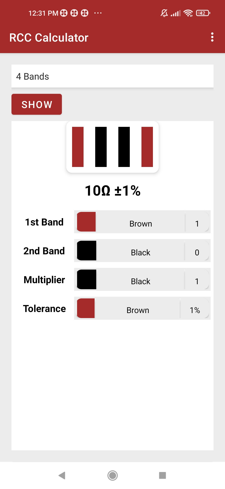
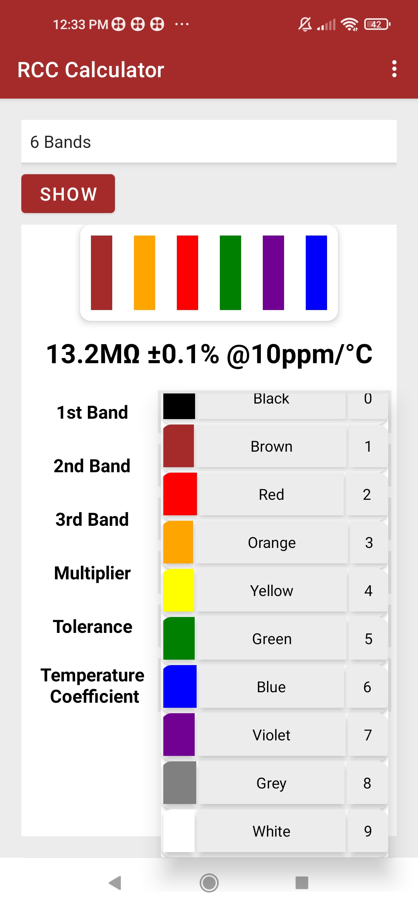

# RCC-Calculator
Resistance calculator based on the Resistor Color Codes 

## RCC-Calculator app calculates the resistance of the resistor based on the colors in its color codes. It helps the professionals and students who work with the circuits and repeatedly calculate the resistance of the resistor
Calculate the resistance of any resistor in seconds !!! 

## RCC-Calculator can be used to calculate the resistance for all 3 types of resistors with 4 / 5 / 6 bands.

# There are 3 fragments dealing with the 3 types of bands in the app:

## 1) band4 fragment:
  This fragment contains the java code to take the input according to the spinners and then calculate the resistance and display it in the textView. The 4 bands include 2 resistor value bands, 1 multiplier band, and 1 tolerance band.
  
## 2) band5 fragment:
  This fragment contains the logic to calculate the resistance of the 5 band resistor. This 5 bands consists of 3 resistor value bands, 1 multiplier band and 1 tolerance band.
  
## 3) band6 fragment:
  The 6 band resistor is very similar to the 5 band resistor but with an extra band which shows the temperature coefficient of the resistor.
  
# There is yet more to be added !!

## Along with the facility to get the resistance from the color codes , The feature to convert the resistance to the color codes is yet to be implemented.
  
  

    &emsp;
  &emsp;
    &emsp;

 
